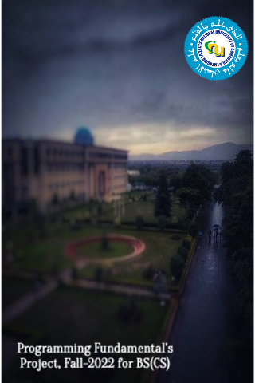

# Tetris Ultimate: PF Edition (SFML 3.0)

A professional, arcade-style Tetris game built from scratch using **Pure C++** and **SFML 3.0**. This project demonstrates advanced procedural programming techniques without the use of Object-Oriented Programming (OOP), strictly following **Programming Fundamentals (PF)** constraints.



## Game Features
- **Full Menu System**: Interactive Main Menu with mouse and keyboard navigation.
- **Ghost Piece (Shadow)**: Real-time projection showing exactly where your block will land.
- **Next Piece Preview**: Strategize your next move with a clear upcoming block display.
- **Dynamic Leveling**: Automatic difficulty scaling (speed increases every 500 points).
- **High Score System**: Persistent score tracking using File I/O (`highscore.txt`).
- **Professional Audio**: Fully integrated background music and sound effects for movement/landing.
- **Smooth Animations**: High-framerate rendering with 30% scaled graphics for better visibility.

##  Controls
### **Main Menu**
- **Up/Down Arrows**: Navigate options
- **Enter**: Confirm selection
- **Esc**: Exit game

### **In-Game**
- **Left/Right Arrows**: Move piece
- **Up Arrow**: Rotate piece
- **Down Arrow**: Soft drop (Slow)
- **Space Bar**: Hard drop (Instant)
- **P Key**: Pause / Resume
- **Esc Key**: Return to Main Menu

## Technical Implementation
This project showcases several core Computer Science concepts:
- **State Machine Architecture**: Managing game states (Menu, Playing, Paused, etc.) using clean procedural logic.
- **Mathematical Centering**: Dynamic UI alignment logic for consistent layouts on any resolution.
- **Modular Codebase**: Split into logical components (`functionality`, `utils`, `pieces`) for maintainability.
- **Dependency Management**: Built with **CMake** and **vcpkg** for modern C++ development.

## Build Instructions
This project uses **CMake** and **vcpkg**. Follow these steps to build locally:

1. **Install Dependencies**:
   Ensure you have [vcpkg](https://github.com/microsoft/vcpkg) installed and SFML 3.0 available.
   
2. **Configure & Build**:
   ```powershell
   # From the project root directory
   cmake -B build -S . -DCMAKE_TOOLCHAIN_FILE="[path_to_vcpkg]/scripts/buildsystems/vcpkg.cmake"
   cmake --build build --config Release
   ```

3. **Run the Game**:
   The executable will be generated in `build/Release/`.
   ```powershell
   cd build/Release
   .\tetris-game.exe
   ```

## 📜 Academic Note
This project was developed for a **Programming Fundamentals (PF)** course. It intentionally avoids Classes, Inheritance, and advanced STL containers to demonstrate mastery of core procedural C++ (Arrays, Structs, Loops, and Functions).

---
Developed by **Areeba Riazz** | Fall 2022 Project for BS(CS)
